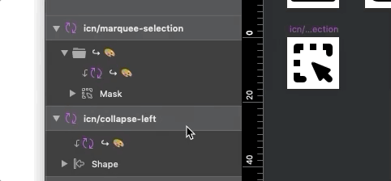

# GitLab Sketch UI Kit

<!-- START doctoc generated TOC please keep comment here to allow auto update -->
<!-- DON'T EDIT THIS SECTION, INSTEAD RE-RUN doctoc TO UPDATE -->

- [Files](#files)
- [Plugins](#plugins)
- [Sketch workflow](#sketch-workflow)
  - [When changes are approved](#when-changes-are-approved)
- [Structure](#structure)
  - [Atoms](#atoms)
  - [Molecules](#molecules)
  - [Organisms](#organisms)
    - [Atomic design example](#atomic-design-example)
- [Symbols](#symbols)
  - [Overrides](#overrides)
- [Icons](#icons)
  - [1. Prepare your icon](#1-prepare-your-icon)
  - [2. Add your icon to the pattern library](#2-add-your-icon-to-the-pattern-library)
  - [3. Add your icon to the instance sheet](#3-add-your-icon-to-the-instance-sheet)
  - [4. Commit and push your changes](#4-commit-and-push-your-changes)
- [Font family](#font-family)

<!-- END doctoc generated TOC please keep comment here to allow auto update -->

## Files

The GitLab Sketch UI Kit is made up of two files:

1. Pattern library: [`gitlab-pattern-library.sketch`][pattern-library] is the
   document that you should [add as a
   Library](https://www.sketch.com/docs/libraries/adding-libraries) in Sketch’s
   preferences. All icons, symbols, layer styles, and text styles are created
   and updated in this file. By definition, it has the [atoms and
   molecules](#structure) of our design system.
1. Instance sheet: [`gitlab-instance-sheet.sketch`][instance-sheet] is where
   you find everything, from icons to complex regions. Copy elements and
   components from here to your Sketch documents. The instance sheet depends on
   the pattern library and extends it, using its atoms and molecules to build
   [organisms](#structure).

We use this two-file structure because links to library symbols and styles are
broken if you copy from the pattern library. By copying from the instance
sheet, library links are kept intact.

## Plugins

Before getting started with the Sketch UI Kit, install the
[recommended plugins][plugins].

## Sketch workflow

There are a few things when working with the Sketch UI Kit that will make the
process of maintaining and updating the files easier for everyone.

1. Ensure all layers have the correct name.
1. Arrange artboards and layers to match reading flow — left to right and top
   to bottom.
1. Use groups to organize related layers.
1. After you’re done editing a group, make sure the `Select group’s contents on
   click` checkbox in the right Inspector panel is unchecked. This will help
   others identify nesting and structure easier.
1. Apply
   [constraints](https://www.sketchapp.com/docs/layer-basics/constraints/) to
   all layers in symbols and groups.
1. Make sure you're not creating a duplicate of an existing pattern, symbol,
   layer style, or text style.
1. Use the proper [structure](#structure) for creating a pattern depending on
   its complexity. Atoms and molecules are symbols, organisms are groups.
1. Use _text styles_ for type, and _layer styles_ for fills, borders, and
   shadows.
1. Follow the [baseline grid](https://design.gitlab.com/layout/grid#baseline-grid) guidelines and [spacing measures](https://design.gitlab.com/layout/spacing).

### When changes are approved

Once the changes to be applied to the Sketch UI Kit have been reviewed and
approved, as a GitLab Product Designer, you should:

1. Check the [repository](/) to see if the pattern library and instance sheet
   files are locked (🔒 icon next to the file name). If someone else locked the
   files (hover the icon to see who), you must wait until they push their
   changes and unlock it. Reach out to them if they are taking too long.
1. [Lock the
   files](https://docs.gitlab.com/ee/user/project/file_lock.html#locking-a-file-or-a-directory)
   to prevent others from overwriting them while you add your changes.
1. In Sketch, close the pattern library or instance sheet files if you have
   them open (or else the next step won't have any effect).
1. Pull the latest changes from the repository to your computer.
1. Open the files in Sketch and add your changes.
   1. First update [icons](#icons), symbols, layer styles, and text styles in
      the pattern library.
   1. Every time the pattern library is changed, update the instance sheet by
      clicking the purple [Library Update Available][sketch-library-updates]
      badge on the top-right corner of the application window.
   1. Update everything else, like organisms, in the instance sheet. Icons need
      to be manually [added to the instance
      sheet](#3-add-your-icon-to-the-instance-sheet).   
   1. When copying things over from another Sketch file, watch out for
      duplicated symbols, layer styles, and text styles. The instance sheet
      should not have any local symbols — if it has a “Symbols” page, it means
      there are local symbols which aren't linked to the pattern library. Some
      of our [recommended plugins][plugins] can help you find and remove
      duplicates.
1. Commit and push your changes, following our [commit
   guidelines](/CONTRIBUTING.md#commits). Do this often so you have a backup of
   your work.
1. [Unlock the
   files](https://docs.gitlab.com/ee/user/project/file_lock.html#unlocking-a-file-or-a-directory)
   so others can work on them.
1. Kick off your shoes and lean back, you did great! 💪

## Structure

We use the [atomic design
methodology](http://bradfrost.com/blog/post/atomic-web-design/) to break
components down into different levels. Within our [Sketch UI Kit
files](#files) we separate them using atoms, molecules, and organisms. Atoms
and molecules live in the **pattern library**, organisms live in the **instance
sheet**.

### Atoms

Atoms are the smallest [_symbols_](#symbols), the building blocks that cannot
be broken down further. They consist of what would be HTML tags, including
forms, labels, inputs, icons, and buttons. Generally, atoms should live as
global components to be reused elsewhere. See the [Icons](#icons) section for contribution guidelines specific to this kind of atom.

### Molecules

Molecules are [_symbols_](#symbols) containing atoms. Besides atoms, they can
also have regular layers. They form functional components and are the basis of
the design system.

### Organisms

Organisms are _groups_ containing atoms and molecules. Besides these symbols,
they can also have regular layers. These help shape the final design of the
interface. By building organisms from atoms and molecules, we encourage
assembling reusable components. This allows designers to manipulate organisms
for their designs, as well as find and use [symbol overrides](#overrides).

#### Atomic design example

The issuable sidebar breaks down components using the atomic methodology. The
collapsed sidebar uses labels and icons as atoms. When put together, we create
the organism from two types of molecules: _icon tabs_ and _icon + label tabs_.

## Symbols

Our Sketch files take advantage of
[symbols](https://www.sketchapp.com/docs/symbols/), [nested
symbols](https://www.sketchapp.com/docs/symbols/nested-symbols/), and
[overrides](https://www.sketchapp.com/docs/symbols/editing-symbols/#overrides)
to make updating components as easy as possible. Symbols can use overrides to
switch between states, colors, text, and more. For an example of a symbol that
uses various types of overrides, look at our _Label + Input_ symbol:

### Overrides

We’ve built out symbols using visual cues that show when and where a component
can be overridden. To make overrides visually distinctive, follow these guidelines:

↪

When an override is nested under another override, preface the layer name with
↪. This will make it easy to see that the override will apply to the override
above it. A common example of this is text within an input or the color of an icon.

💡

When an override changes the state of the component, preface the layer name with
💡. This will make it easy to see that the override will apply a state change.
A common example of this is when applying a hover or active state to a component.

🎨

When an override changes the color of the component, preface the layer name with
🎨. This will make it easy to see that the override will apply a color change.
A common example of this is changing the color of a background or icon.

## Icons

### 1. Prepare your icon

1. Make sure your icon is no larger than `14px x 14px` and is centered on a `16px x 16px` artboard that has no background.
1. Create a symbol of your icon artboard and name it following the naming convention: `icn/[icon-name]` 
1. Ensure your icon was designed using `#000000` as the only fill color.
1. Remove any layer styles that might be applied to your icons.

### 2. Add your icon to the pattern library

1. Paste your icon symbol artboard into the pattern library, in the **Icons**
   page. You can place it in the last row, or if the row is complete, start a
   new row. It should look like this at this point:

2. Copy and paste the masked override layer from another icon in the page into
   your icon group.

3. Mask your shape with the override layer. This will create a group and rename
   your shape layer to mask.

4. Move both the shape and the masked override outside the group folder and
   delete the now empty group folder. Rename the layer to `Shape` from `Mask`.

5. Save the file with your new icon added. 👍

### 3. Add your icon to the instance sheet

1. Your icon should now be a symbol and ready to add to the instance sheet.
   Open the instance sheet and [update the Library][sketch-library-updates] to
   fetch the icon changes you made in the pattern library.
1. In the **Icons** page, find alphabetically where your symbol belongs. Add it
   to the end of the row or start a new row if there is no space.
1. Align your icon with the other icons in the sheet both vertically and
   horizontally.
1. Save the changes you made to the file. 👍

### 4. Commit and push your changes

And now your icon is ready to use! 🎉 💪

## Font family

While GitLab uses system fonts, the GitLab Sketch UI Kit makes use of the
Helvetica Neue font family. Helvetica Neue is one our fall back fonts within
our font stack and is readily available on all Mac systems.

San Francisco is often recommended as an alternative because it is the macOS
font and it is available for download. However, due to [license
restrictions](https://en.wikipedia.org/wiki/San_Francisco_(sans-serif_typeface)#cite_ref-Apple_Developer_Fonts_3-2),
we are unable to use it within our Sketch UI Kit.

[pattern-library]: /gitlab-pattern-library.sketch
[instance-sheet]: /gitlab-instance-sheet.sketch
[sketch-library-updates]: https://www.sketch.com/docs/libraries/library-updates
[plugins]: /CONTRIBUTING.md#plugins
